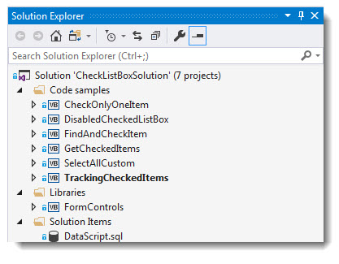

# Common CheckedListBox operations

This repository provides code samples for CheckedListBox using VB.NET to show several common operations that developers struggle with. 

> Data is read from a SQL-Server database utilizing a NuGet package for managing connections and exception handling.

### Microsoft documentation
[CheckedListBox Control Overview (Windows Forms)](https://docs.microsoft.com/en-us/dotnet/framework/winforms/controls/checkedlistbox-control-overview-windows-forms)

### See also
[VB.NET: Defensive data programming (Part 3)](https://social.technet.microsoft.com/wiki/contents/articles/51638.net-defensive-data-programming-part-3.aspx)

[VB.NET Working with parameterized SQL operations part 2](https://social.technet.microsoft.com/wiki/contents/articles/51456.working-with-parameterized-sql-operations-part-2.aspx)

[C# DataGridView - ListBox - CheckListBox - ListView move items up/down](https://social.technet.microsoft.com/wiki/contents/articles/51662.c-datagridview-listbox-checklistbox-listview-move-items-updown.aspx)

